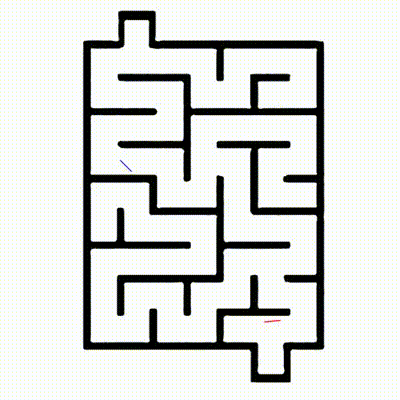
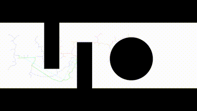

# Overview 

For exploration, localization, mapping and navigation, mobile robots need to employ computationally efficient (optimal) and smarter (collision-free) path-planning strategies for performance optimization. The Bi Directional RRT algorithm simultaneously explores the configuration space in both directions by using two trees that grow from the initial and goal states. RRT-Connect, in contrast, iteratively connects two trees by growing them closer to one another. Two trees grow from initial and target point respectively with the end position of each other as the target, and connect to the last expansion of each other.
**BTO-RRT** takes advantage of bi-directional RRT and RRT connect - modify the extension rules for more target-oriented with faster connections. In BTO-RRT, the start node explores throughout the map assuming the goal node as its target while the goal node explores assuming the end position of start point as target.

This work is inspired from [1] and has been implemented using Python for 2-D. The path planning with BTO-RRT is implemented in a 3-D Simulation Gazebo World using ROS Noetic. In this setup, the TurtleBot navigates from its starting position to a specified goal point along the path generated by the BTO-RRT algorithm. A closed loop controller is implemented to control the robot’s linear speed and angular speed while it is navigating through an optimal path and avoiding obstacles.


## Part - 1 (2D Implementation)

### Instructions to Run the Code 

1. Use source code "code/vinay06_anuj_final2Dcode.py" file from folder and open any Python IDE or terminal. Map being tested should be in same directory as source code
2. If Python IDE is used, please click on the run button
Note : Before running please make sure whether these libraries are installed in the system : numpy,cv2,matplotlib,time.
       
```bash
	#Test Case 1 : 
	Enter the x-coordinate of start node
	 10
	Enter the y-coordinate of start node
	 10
	Enter the x-coordinate of goal node
	 490
	Enter the y-coordinate of goal node
	 490
```
4. Once the code is run, a few information about the code is printed on the console and the cv2 visualisation video is recorded and saved
5. Video will be saved under the name "BTO-RRT.avi". Alternatively, you can find the video in below links
6. Please make sure you have the maps given in zip folder in the same directory where the code is being run.
### Results

The results and testing on different maps can be viewed from results folder. The video below shows the BTO-RRT planning executed in 2-D

<p align="center">
<br>
<em>Figure: BTO-RRT Planning in 2-D</em>
</p>


## Part - 2 (3D Implementation)
### Instructions to Run the Code 
```bash
	# Test Case
	Enter the x-coordinate of start node
	 10
	Enter the y-coordinate of start node
	 10
	Enter the x-coordinate of goal node
	 490
	Enter the y-coordinate of goal node
	 490
```
1. Keep the folder "bto_gazebo" inside the source folder of your respective ros workspace.
2. Perfrom below set of commands now on the terminal window
	* cd ~/catkin_ws
	* catkin_make
	* source devel/setup.bash
	* roslaunch bto_gazebo bto_gazebo.launch
	* rosrun bto_gazebo bto_gazebo.py (In another terminal)
3. A new terminal window will be opened where you need to enter the coordinates as in Test Case.
4. The turtlebot keeps moving to its goal point. The video link for the same is in the presentation slides and also in the zip folder.

### Results

The below Video shows how the turtlebot moves in an optimal path derived from the algorithm.
<p align="center">
<br>
<em>Figure: BTO-RRT Planning in 3-D</em>
</p>

### Project Members:
1. Anuj Zore 
2. Vinay Krishna Bukka 

### Credits(Paper Reference) : 

1. Zheng, Z., Bewley, T. R., Kuester, F., & Ma, J. (2022). BTO-RRT: A rapid, optimal, smooth and point cloud-based path planning algorithm
	
